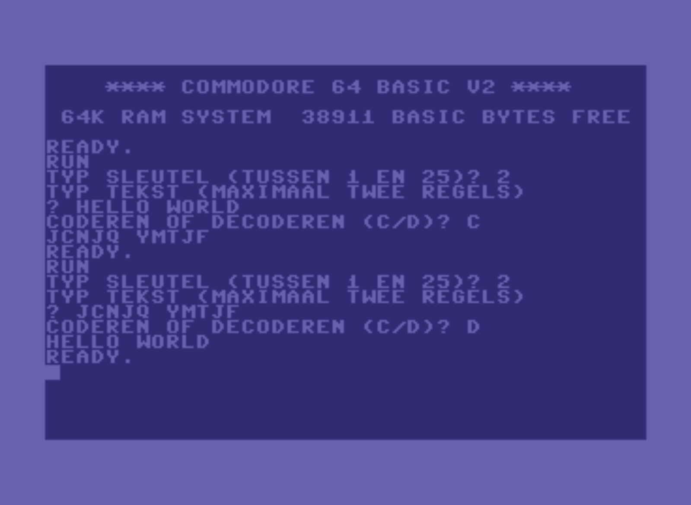

# decoder-voor-cbm-64

This is a coder / decoder program written in the Basic programming language.

The source code is copied from the mini booklet: *Handboek Spion deel 1*

The mini booklet was an supplement that was issued together with the dutch comic book magazine 'Eppo' in 1985.

It was written for a Commodore 64 computer, but since it is written in Basic,
it can be run on any machine with a Basic interpreter.

## Resources

https://en.wikipedia.org/wiki/Eppo_(comics)