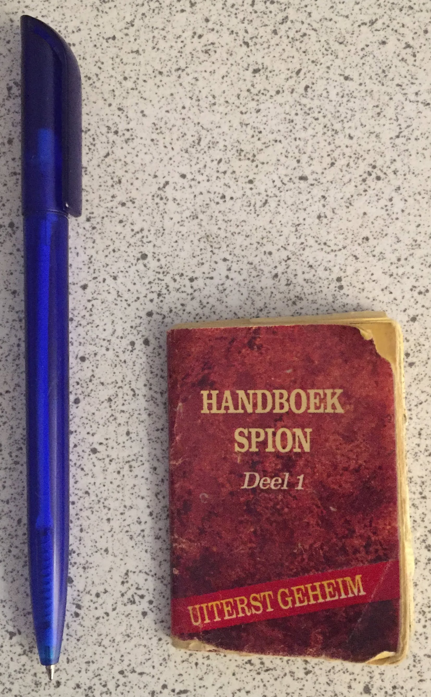
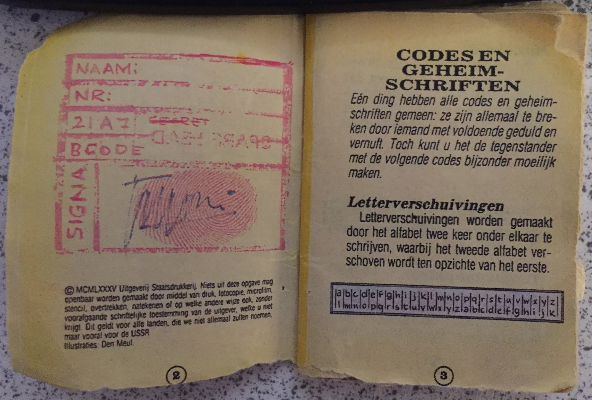
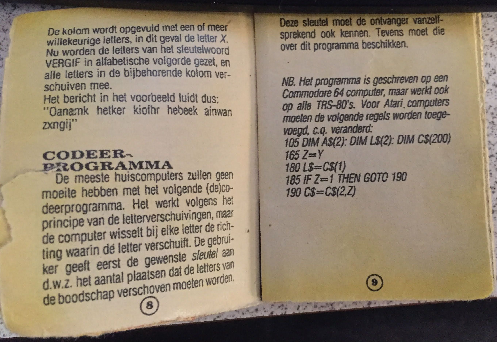
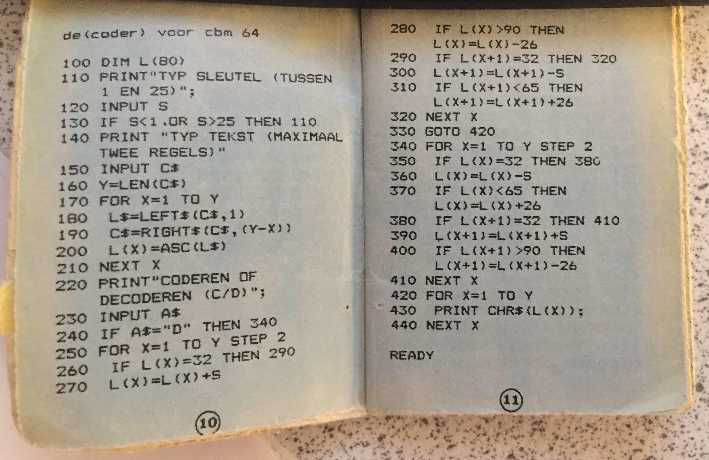

# decoder-voor-cbm-64

This is a coder / decoder program written in the Basic programming language.

The source code is copied from the mini booklet: *Handboek Spion deel 1*
The mini booklet was an add on by dutch comic book magazine 'Eppo' 

It was written for a Commodore 64 computer, but since it is basic it can be run on any machine that can run basic.

## Resources

https://en.wikipedia.org/wiki/Eppo_(comics)